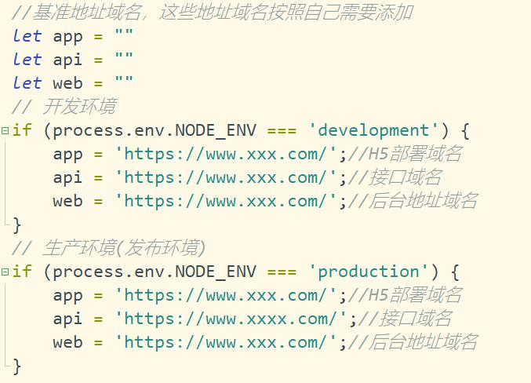
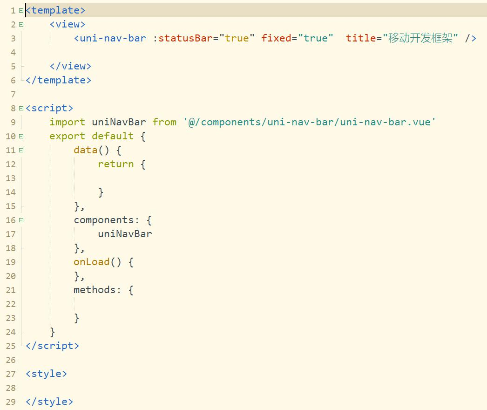
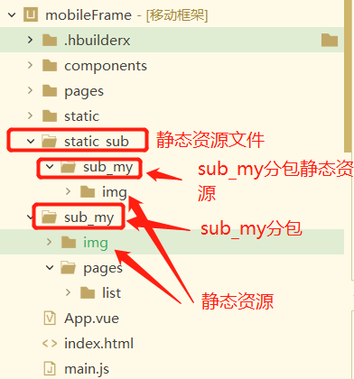

# 移动端电商平台案例

#### 介绍
此项目框架是使用uniapp空项目搭建的移动端开发框架，支持微信小程序 + H5+ 公众号 + APP开发，封装了request接口、微信支付、扫码、分包、正则表达式、常用方法、页面跳转和MD5等功能，框架搭建未使用UI库，若需要使用UI库去[插件市场](https://ext.dcloud.net.cn/)自行导入。

1.  框架搭建步骤已写在[博客文章](https://www.cnblogs.com/Intellectualscholar/category/2103013.html)可以学习
2.  此电商案例使用个人搭建的开发框架，为开发框架的使用案例

#### 软件架构
软件架构说明


#### 安装教程

1.  开发工具：HbuilderX、微信开发者工具
2.  安装依赖：npm install 
3.  使用到的依赖有：第三方微信JSSDK(npm install weixin-js-sdk -S)、 md5加密(npm install --save js-md5)

#### 框架使用说明
一、框架开发准备：
1.  使用开发工具：HbuilderX、微信开发者工具(微信小程序、微信公众号)、支付宝小程序开发工具(支付宝小程序、钉钉小程序)
2.  安装依赖：npm install 
3.  目前使用到的依赖有：微信JSSDK(npm install weixin-js-sdk -S)、 md5加密(npm install --save js-md5)

二、框架使用：<br/>
1. 修改common文件夹下sju.ajax的接口基准地址域名，改为自己接口的域名<br/>


2. 页面使用自定义导航栏<br/>

	使用自定义标题栏需要把pages.json的globalStyle的导航栏样式取消默认的原生导航栏<br/>
```
	//基础自定义导航栏
	<uni-nav-bar :statusBar="true" fixed="true" title="移动开发框架" />
	//返回上一页`<br/>
	<uni-nav-bar leftIcon="arrowleft" :statusBar="true" fixed="true" title="移动开发框架" />
	//修改字体颜色`<br/>
	<uni-nav-bar color="#000" :statusBar="true" fixed="true" title="移动开发框架" />
	//修改背景颜色`
	<uni-nav-bar bgImage="linear-gradient(45deg, #02133f, #6739b6)" :statusBar="true" fixed="true" title="移动开发框架" />

```


3. 基础封装方法使用<br/>
```
	let value=''
	///MD5加密
	this.sjuBase.toMD5('123')
	
	//判断是否空值,如果是空值,则返回true
	this.sjuBase.isNull(value)
	
	//判断是否非空值,如果是非空值,则返回true
	this.sjuBase.isNotNull(value)
	
	//检查是否非空,如果非空,返回True,否则返回false,并显示错误提示:
	this.sjuBase.checkNotNull(value,'参数不能为空')
	
	//检查非空数组:
	let checkNullArr = [{
			val: this.telephoneNo,
			msg: '手机号必填'
		}, {
			val: this.loginPassword,
			msg: '密码必填'
		}];
	this.sjuBase.checkArrayNotNull(checkNullArr)
```
4. 消息框使用<br/>
```
	//提示消息(要显示的消息,显示时间)
	this.sjuAlert.showInfo('消息内容',2000)
	
	//提示错误消息,需要点击确认后关闭
	this.sjuAlert.showError('错误消息','提示框标题')
	
	//提示,确认后进行页面跳转
	this.sjuAlert.showAndRedirect('消息内容','页面路由','提示框标题')
	
	//提示确认框
	this.sjuAlert.showConfirm('消息内容',()=>{
		//点击确认后执行方法`
			
		},()=>{
			//点击取消后执行方法
				
		},'提示框标题')
	
	//显示等待框
	this.sjuAlert.showLoading()
	
	//隐藏等待框
	this.sjuAlert.hideLoading()
```

5. 正则封装方法使用
```
	//======= 正则封装方法多个校验值使用数组对象传值 =========
	// 检查正则数组
	let checkRegexArr = [{
			val: this.username,	//检验值
			type: 'username',	//校验类型 
			msg: '用户名不合法'	//消息提示内容
		},
		{
			val: this.loginPassword,
			type: 'password',
			msg: '密码应包含至少8个字符,包含数字和字母！'
		},
		{
			val: this.phoneNumber,
			type: 'phoneNumber',
			msg: '请输入正确的手机号'
		},
		{
			val: this.idNumber,
			type: 'idCard',
			msg: '请输入正确的身份证编号'
		},
		{
			val: this.Number,
			type: 'money',
			msg: '请输入正确的金额'
		},
		{
			val: this.bankNumber,
			type: 'bankNumber',
			msg: '请输入正确的银行卡号'
		},
		{
			val: this.Email,
			type: 'Email',
			msg: '请输入正确的邮箱地址'
		}
	]
	this.sjuRegex.checkArray(checkRegexArr)
	
	//======= 正则封装方法单个检验值使用 =========
	this.sjuRegex.password(value)
	
```

6. 用户登录状态的相关封装使用
```
	sju.login.js:往下面数组添加不需要登录的页面路径地址
	noLogin:['/tab/index']
	
	//页面中检测页面是否需要登录
	this.sjuLogin.checkLogin('页面路径')
	
	//微信小程序登录
	this.sjuLogin.weixinInfo()
	
	//本地存储
	this.sjuLogin.saveValue('key键值','保存的值')
	
	//从本地存储获取key数据
	this.sjuLogin.getValue('key键值')
	
	//从本地存储清除某个key
	this.sjuLogin.clearKey('key键值')
	
	//从本地存储清除所有数据
	this.sjuLogin.clearAll()
	
```

7. 页面跳转
```
	//保留当前页面,跳转到应用内的某个页面,使用uni.navigateBack可以返回到原页面
	this.sjuNav.navigateTo(url)
	
	//关闭当前页面,跳转到应用内的某个页面
	this.sjuNav.redirectTo(url)
	
	//关闭所有页面,跳转到应用内的某个页面
	this.sjuNav.reLaunch(url)
	
	//跳转到 tabBar 页面,并关闭其他所有非 tabBar 页面
	this.sjuNav.switchTab(url)
	
	//关闭当前页面,返回上一页面或多级页面,
	this.sjuNav.navigateBack()		//返回上一页
	this.sjuNav.navigateBack(delta)	//delta:返回的页面数,默认返回上一页

```


8.网络请求使用
```
	//无参请求
	Get() {
		this.sjuAjax.get("api接口名称",'', res=>{
			console.log(res)
	  
		})
	},
	//带参请求
	Get1() {
		this.sjuAjax.get("api接口名称", {
				data1:this.data1,
				data2:this.data2
			}, res=>{
				console.log(res)
				  
		})
	},
	Post() {
		this.sjuAjax.post("api接口名称", {
				data1:this.data1,
				data2:this.data2
			}, res=>{
				console.log(res)
				  
		})
	},
	Put() {
		this.sjuAjax.put("api接口名称", {
				data1:this.data1,
				data2:this.data2
			}, res=>{
				console.log(res)
				  
		})
	},
	Delete() {
		this.sjuAjax.delete("api接口名称", {
				data1:this.data1,
				data2:this.data2
			}, res=>{
				console.log(res)
			  
		})
	}
```

9. 调用微信支付
```
	//======= H5调用微信支付封装方法 =======
	//请求后台的微信支付方法获取支付参数
	this.sjuAjax.post('/api/xxx/weixinPay', {
		openID: openID,//微信openID
		orderCodePay: orderCodePay,//订单编号
		userCode: this.jsLogin.getValue('userCode') //用户编号
	}, data => {
		console.log(data)
		//获取成功后，前端调起微信支付
		var orderInfo = JSON.parse(data.orderInfo);
		this.sjuPay.payWeixinH5(orderInfo, orderCodePay);
	}, true);
	
	//======= 微信小程序调用微信支付封装方法 =======
	//请求后台的微信支付方法获取支付参数
	this.sjuAjax.post('/api/xxx/weixinPay', {
	    openID: openID,//微信openID
	    orderCodePay: orderCodePay,//订单编号
	    userCode: this.jsLogin.getValue('userCode') //用户编号
	}, data => {
	    console.log(data)
	    //获取成功后，前端调起微信支付
	    this.sjuPay.payWeiXinApp(orderCodePay);
	}, true);

```

10. 调用微信封装方法
```
	//========== H5调用自定义分享 ===========
	//这里使用到了 this.$title 和 this.$desc 的变量，需要在 main.js 里面定义
	//因为自定义分享功能是多页面使用，分享标题和分享描述基本上都是固定的，后面改变标题或者描述
	//只需把mian.js的变量修改一下即可
	onShow() {
		//调用微信配置接口
		// #ifdef H5
			this.sjuWeiXin.weixinJSConfig(this.$title,'linkUrl(分享页面路径(字符串空默认首页))','分享图片路径(网络图片)',this.$desc);
		// #endif
	}
	
	//========== H5调用扫码功能 ===========
	this.sjuWeiXin.scanQRCode()

```

11. 分包机制使用
	1. 在项目文件夹下新建static_sub文件夹用于存放分包静态资源文件,静态资源存放文件夹要与分包名称一致。
	
	
	2. 在pages.json中填写分包配置和分包预加载配置,preloadRule:配置preloadRule后，在进入小程序某个页面时，由框架自动预下载可能需要的分包，提升进入后续分包页面时的启动速度。
```

	{
	    "pages": [ //pages数组中第一项表示应用启动页，参考：https://uniapp.dcloud.io/collocation/pages
	        {
	            "path": "pages/index/index",
	            "style": {}
	        },
	        {
	            "path" : "pages/my/my",
	            "style" : {}
	        }
	    ],
	    // 分包配置
	    "subPackages": [
	        {
	            // my分包
	            "root": "sub_my",
	            "name": "my",
	            "pages": [{
	                // 详情
	                "path": "pages/list/list",
	                "style": {}
	            }]
	        }
	    ],
	　　// 分包预加载配置
	    "preloadRule": {
	        // 进入我的后，预加载我的
	        "pages/tab/my/my": {
	            "network": "all",
	            "packages": ["my"]
	        }
	　　　},
	    //tabBar页面
	    "tabBar": {
	        "list": [{
	                "pagePath": "pages/tab/index/index",
	                "iconPath": "/static/tabImage/home.png",
	                "selectedIconPath": "/static/tabImage/home1.png",
	                "text": "首页"
	            },
	            {
	                "pagePath": "pages/tab/my/my",
	                "iconPath": "/static/tabImage/user.png",
	                "selectedIconPath": "/static/tabImage/user1.png",
	                "text": "我的"
	            }
	        ],
	        "color": "#999999",
	        "selectedColor": "#593A25",
	        "borderStyle": "white",
	        "backgroundColor": "#fff"
	    },
	    "globalStyle": {
	        "navigationStyle": "custom",
	        "navigationBarTextStyle": "black",
	        "navigationBarTitleText": "移动端框架",
	        "navigationBarBackgroundColor": "#F8F8F8",
	        "backgroundColor": "#F8F8F8"
	    }
	}

```

#### 参与贡献

1.  Fork 本仓库
2.  新建 Feat_xxx 分支
3.  提交代码
4.  新建 Pull Request

#### 其他说明
1. 允许个人学习研究使用，支持二次开发，允许商业用途（仅限自运营）。
2. 允许商业用途，但仅限自运营，如果商用必须保留版权信息，望自觉遵守。
3. 不允许对程序代码以任何形式任何目的的再发行或出售，否则将追究侵权者法律责任。
4. 


#### 特技

1.  使用 Readme\_XXX.md 来支持不同的语言，例如 Readme\_en.md, Readme\_zh.md
2.  Gitee 官方博客 [blog.gitee.com](https://blog.gitee.com)
3.  你可以 [https://gitee.com/explore](https://gitee.com/explore) 这个地址来了解 Gitee 上的优秀开源项目
4.  [GVP](https://gitee.com/gvp) 全称是 Gitee 最有价值开源项目，是综合评定出的优秀开源项目
5.  Gitee 官方提供的使用手册 [https://gitee.com/help](https://gitee.com/help)
6.  Gitee 封面人物是一档用来展示 Gitee 会员风采的栏目 [https://gitee.com/gitee-stars/](https://gitee.com/gitee-stars/)
